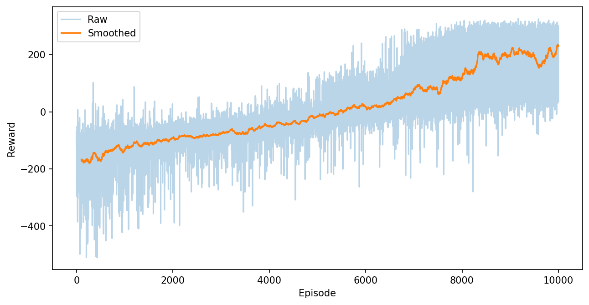

# Deep Q-Network (DQN) for LunarLander

This repository contains a PyTorch implementation of a Deep Q-Network (DQN) agent trained to solve the LunarLander-v2 environment. The project focuses on clean reinforcement learning fundamentals and stable training behavior.

## Overview

The LunarLander environment requires an agent to control a spacecraft and land it safely between two flags. The agent learns a policy by approximating the action-value function using a neural network trained with temporal-difference learning.

Key characteristics:
- Environment: LunarLander-v2
- Algorithm: Deep Q-Network (DQN)
- Framework: PyTorch
- Action space: Discrete
- Learning type: Off-policy

## Repository Structure

- agent.py  
  Implements the DQN agent, including action selection, epsilon decay, and learning updates.

- network.py  
  Defines the neural network used to approximate Q-values.

- replay_buffer.py  
  Experience replay buffer for storing and sampling transitions.

- helpers.py  
  Utility functions for logging, reward smoothing, and plotting.

- main.py  
  Entry point for training the agent.

- requirements.txt  
  Project dependencies.

- dqn_lunarlander.pth  
  Saved trained model weights.

- training_curve.png  
  Training reward visualization.

## Model Architecture

The Q-network is a fully connected feedforward neural network that maps environment states to Q-values for each action. The network is trained using mean squared error loss and optimized with Adam.

## Training Results

Training begins with high variance in episodic rewards due to exploration. As epsilon decays, the reward curve becomes more stable and trends upward, indicating that the agent learns a reliable landing policy.

A visualization of episodic rewards.

## Usage

Running the training script initializes the environment, trains the DQN agent over multiple episodes, periodically updates the target network, and saves the trained model weights.

## Saved Model

The trained model parameters are stored in the dqn_lunarlander.pth file and can be loaded later for evaluation or inference.
