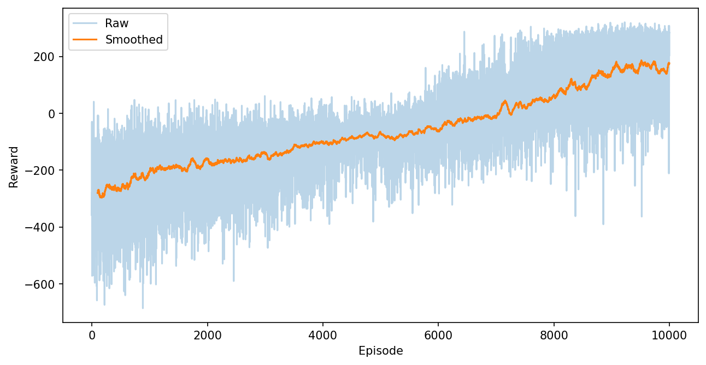

# Deep Q-Network (DQN) for LunarLander

This repository contains a **PyTorch implementation of a Deep Q-Network (DQN)** agent trained on the **LunarLander** environment using Gymnasium.  
The project emphasizes **clean reinforcement learning fundamentals**, modular design, and stable training behavior.

Two environment variants are implemented to study the effect of external disturbances (wind).

---

## Project Variants

### Version 1 — No Wind
- Environment: `LunarLander-v3`
- Wind: **Disabled**
- Purpose: Baseline training under standard dynamics

### Version 2 — Wind Enabled
- Environment: `LunarLander-v3`
- Wind: **Enabled**
- Purpose: Evaluate robustness under stochastic disturbances

> Apart from wind settings, **all hyperparameters and architecture remain identical** across both versions.

---

## Algorithm Overview

- **Algorithm**: Deep Q-Network (DQN)
- **Learning Type**: Off-policy
- **Action Space**: Discrete
- **State Space**: Continuous
- **Framework**: PyTorch
- **Environment API**: Gymnasium

The agent learns an action-value function Q(s, a) using:
- Experience Replay
- Target Network Stabilization
- ε-greedy Exploration
- Temporal-Difference Learning

---
## Hyperparameters

| Parameter                  | Value        |
|----------------------------|--------------|
| Discount factor (γ)        | 0.99         |
| Learning rate              | 1e-3         |
| Replay buffer capacity     | 100,000      |
| Batch size                 | 32           |
| Target network update freq | 1000 steps   |
| Initial ε                  | 1.0          |
| ε decay                    | 0.0001       |
| Minimum ε                  | 0.05         |
| Gradient update frequency  | Every 4 steps |
| Gradient clipping          | 1.0 (L2 norm) |

---


## Repository Structure

```
.
├── agent.py
├── network.py
├── replay_buffer.py
├── helpers.py
├── lunarlander_V1.py
├── lunarlander_V2.py
├── requirements.txt
├── dqn_lunarlander_v1.pth
├── dqn_lunarlander_v2.pth
├── assets/
│   ├── training_curve.png
│   ├── training_curve_model2.png
│   └── videos/
│       ├── model_1/
│       │   ├── rl-video-episode-0.mp4
│       │   ├── rl-video-episode-1.mp4
│       │   ├── rl-video-episode-2.mp4
│       │   ├── rl-video-episode-3.mp4
│       │   └── rl-video-episode-4.mp4
│       └── model_2/
│           ├── rl-video-episode-0.mp4
│           ├── rl-video-episode-1.mp4
│           ├── rl-video-episode-2.mp4
│           ├── rl-video-episode-3.mp4
│           └── rl-video-episode-4.mp4
└── README.md

```

---

## Model Architecture

The Q-network is a fully connected feedforward neural network that maps environment states to Q-values for each discrete action.

- Loss: Mean Squared Error (MSE)
- Optimizer: Adam
- Target network updated periodically for stability

---

## Training Behavior

- Initial training exhibits high reward variance due to exploration
- As ε decays, learning stabilizes and rewards improve
- Wind-enabled training (V2) converges more slowly and shows higher variance, reflecting increased environment difficulty
### Training Curve (Wind Disabled)

### Training Curve (Wind Enabled)



---
## Demo Videos

- [Model V1 – No Wind](assets/videos/model_1/)
- [Model V2 – Wind Enabled](assets/videos/model_2/)

---

## Usage

### Install Dependencies
```bash
pip install -r requirements.txt
```

### Train — Version 1 (No Wind)
```bash
python lunarlander_V1.py
```

### Train — Version 2 (Wind Enabled)
```bash
python lunarlander_V2.py
```

### Resume Training (Warm Start)
If a saved model file exists, training resumes from the latest checkpoint automatically.

---

## Saved Models

- `dqn_lunarlander_v1.pth` — Trained model without wind
- `dqn_lunarlander_v2.pth` — Trained model with wind

---
