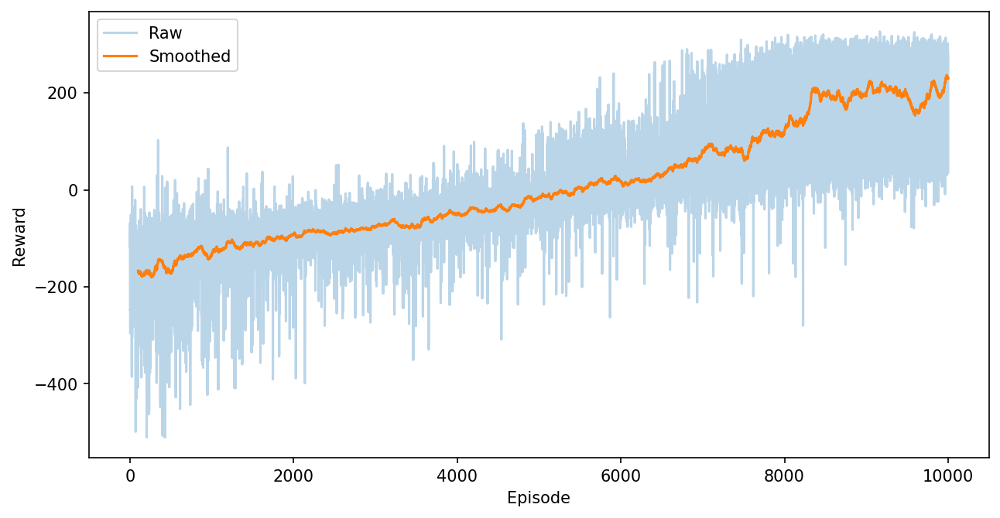
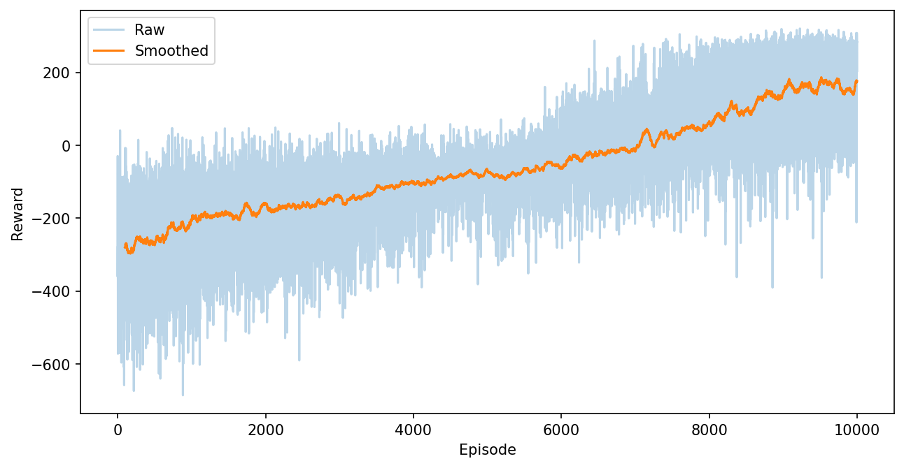

# Deep Q-Network (DQN) for LunarLander


A modular PyTorch implementation of Double DQN trained on the LunarLander-v3 environment. Two variants are trained — standard dynamics and wind-enabled — to study the effect of stochastic disturbances on learning stability and final performance.

---

## Table of Contents

- [Project Overview](#project-overview)
- [Repo Structure](#repo-structure)
- [Algorithm](#algorithm)
- [Network Architecture](#network-architecture)
- [Hyperparameters](#hyperparameters)
- [Results](#results)
- [Visualizations](#visualizations)
- [Saved Models](#saved-models)
- [Reproducibility](#reproducibility)
- [Requirements](#requirements)
- [How to Run](#how-to-run)
- [License](#license)

---

## Project Overview

The LunarLander-v3 environment requires an agent to fire thrusters to land a spacecraft between two flags without crashing. The state space is continuous (8 dimensions), the action space is discrete (4 actions), and the reward function penalizes fuel use, crashes, and proximity to the landing pad.

This project trains a Double DQN agent on two variants of the environment. V1 uses standard dynamics. V2 enables wind (`wind_power=15.0`, `turbulence_power=1.5`), introducing stochastic disturbances that destabilize the lander mid-flight and require the agent to learn more robust control policies.

All hyperparameters and architecture are identical across both variants — only the environment changes.

---

## Repo Structure

```
.
├── agent.py                      # Agent: Double DQN logic, epsilon-greedy, target network
├── network.py                    # Q-network architecture
├── replay_buffer.py              # Experience replay buffer
├── helpers.py                    # Training loop, evaluation, reward plotting
├── lunarlander_V1.py             # Entry point — no wind
├── lunarlander_V2.py             # Entry point — wind enabled
├── requirements.txt
├── dqn_lunarlander_v1.pth        # Trained weights — V1
├── dqn_lunarlander_v2.pth        # Trained weights — V2
├── assets/
│   ├── training_curve_model_1.png
│   ├── training_curve_model2.png
│   └── videos/
│       ├── model_1/
│       │   ├── rl-video-episode-0.mp4
│       │   ├── rl-video-episode-1.mp4
│       │   ├── rl-video-episode-2.mp4
│       │   ├── rl-video-episode-3.mp4
│       │   └── rl-video-episode-4.mp4
│       └── model_2/
│           ├── rl-video-episode-0.mp4
│           ├── rl-video-episode-1.mp4
│           ├── rl-video-episode-2.mp4
│           ├── rl-video-episode-3.mp4
│           └── rl-video-episode-4.mp4
└── README.md
```

---

## Algorithm

The agent implements **Double DQN**, an improvement over vanilla DQN that decouples action selection from action evaluation to reduce overestimation bias in Q-value targets.

**Vanilla DQN target:**
```
target = r + γ · max_a Q_target(s', a)
```

**Double DQN target (implemented here):**
```
a* = argmax_a Q_online(s', a)        # online net selects action
target = r + γ · Q_target(s', a*)   # target net evaluates it
```

This is implemented in `agent.py` lines 64–71. The online network selects the best next action; the target network scores it. This prevents the target net from both selecting and evaluating the same action, which is the source of overestimation in standard DQN.

**Additional stabilization techniques:**

- **Experience Replay** — transitions stored in a 100k-capacity buffer, sampled uniformly at batch size 32
- **Target Network** — hard-updated every 1,000 steps; keeps training targets stable
- **Gradient Clipping** — L2 norm clipped at 1.0 per update step
- **ε-greedy Exploration** — linear decay from 1.0 to 0.05 at rate 0.0001 per episode
- **Update Frequency** — gradient update every 4 environment steps, not every step

---

## Network Architecture

The Q-network (`network.py`) is a fully connected feedforward network mapping the 8-dimensional state to Q-values for each of the 4 discrete actions.

```
Input (8)
  └── Linear(8 → 128) + ReLU       # ~1,152 params
  └── Linear(128 → 128) + ReLU     # ~16,512 params
  └── Linear(128 → 4)              # ~516 params
Output (4)
# total params: ~18,180
```

- Loss: MSE between predicted Q(s,a) and Double DQN target
- Optimizer: Adam
- Two identical instances maintained: online net (trained) and target net (periodically synced)

---

## Hyperparameters

| Parameter | Value |
|---|---|
| Discount factor (γ) | 0.99 |
| Learning rate | 5e-4 |
| Replay buffer capacity | 100,000 |
| Batch size | 32 |
| Target network update frequency | 1,000 steps |
| Initial ε | 1.0 |
| ε decay rate | 0.0001 per episode |
| Minimum ε | 0.05 |
| Gradient update frequency | Every 4 env steps |
| Gradient clipping | 1.0 (L2 norm) |
| Training episodes | 10,000 |

Note: learning rate is `5e-4` as passed in both entry point scripts, overriding the `1e-3` default in `Agent.__init__`.

---

## Results

### V1 — No Wind

### Training Curve (No Wind)



Initial episodes show high variance and negative rewards as the agent explores randomly. As ε decays and the replay buffer fills, rewards stabilize and trend upward. The smoothed curve (100-episode window) reflects consistent improvement toward successful landings.

---

### V2 — Wind Enabled (`wind_power=15.0`, `turbulence_power=1.5`)

### Training Curve (Wind Enabled)



Wind introduces stochastic lateral forces mid-flight, making the control problem significantly harder. Convergence is slower and reward variance remains higher throughout training compared to V1. The agent must learn to compensate for disturbances it cannot directly observe in the state representation.

---

## Demo Videos

- [V1 — No Wind](assets/videos/model_1/)
- [V2 — Wind Enabled](assets/videos/model_2/)

---

## Saved Models

| File | Environment | Description |
|---|---|---|
| `dqn_lunarlander_v1.pth` | No wind | Trained online network weights — V1 |
| `dqn_lunarlander_v2.pth` | Wind enabled | Trained online network weights — V2 |

Models are saved as `state_dict` and loaded via `agent.load(path)`.

---

## Reproducibility

No fixed random seed is set at the environment or NumPy level in the current implementation. KMeans-style initialization variance does not apply here, but episode-level stochasticity means exact reward curves will vary between runs. The trained `.pth` weights are provided for deterministic evaluation.

---

## Requirements

```
torch
gymnasium
box2d-py
numpy<2
matplotlib
pyyaml
```

Install with:

```bash
pip install -r requirements.txt
```

---

## How to Run

### Train — V1 (No Wind)

Set `TRAIN = True` in `lunarlander_V1.py`, then:

```bash
python lunarlander_V1.py
```

### Train — V2 (Wind Enabled)

Set `TRAIN = True` in `lunarlander_V2.py`, then:

```bash
python lunarlander_V2.py
```

### Evaluate (Render)

Set `TRAIN = False` (default) and ensure the corresponding `.pth` file is present:

```bash
python lunarlander_V1.py   # evaluates dqn_lunarlander_v1.pth
python lunarlander_V2.py   # evaluates dqn_lunarlander_v2.pth
```

Evaluation runs 5 episodes with `render_mode="human"` and ε set to 0.

---

## Key Takeaways

- Double DQN's decoupling of action selection and evaluation is a small code change with a meaningful impact on training stability — vanilla DQN on LunarLander tends to overestimate Q-values and destabilize late in training.
- Updating every 4 environment steps rather than every step reduces correlation between consecutive gradient updates and meaningfully improves sample efficiency.
- Wind-enabled training does not just slow convergence — it changes the policy the agent learns. A V1-trained agent transferred to a wind environment performs noticeably worse, suggesting the two environments require genuinely different control strategies.
- Gradient clipping at 1.0 is essential for this setup. Without it, early training with random targets produces large loss spikes that can corrupt the network weights.

---

## Failed Experiments

- **Vanilla DQN (no Double DQN)** — overestimation bias caused Q-values to diverge in later training episodes, leading to unstable behavior after initial convergence.
- **Update every step** — training every environment step instead of every 4 steps led to noisier gradients and slower convergence due to high correlation between consecutive transitions.

---

## Limitations

- No random seed is fixed at the global level, so training curves are not exactly reproducible run-to-run. Adding `torch.manual_seed` and `np.random.seed` would address this.
- The wind disturbance is stochastic but not observable in the state — the agent cannot distinguish a wind-affected state from a standard one, which caps the policy quality achievable on V2.
- MSE loss is used for Q-value regression. Huber loss is generally preferred for RL because it is less sensitive to outlier target values, which occur frequently during early exploration.
- No prioritized experience replay. Uniform sampling means rare high-reward transitions are seen proportionally less often than low-reward ones, which can slow learning of the landing behavior.

---

## License

MIT
